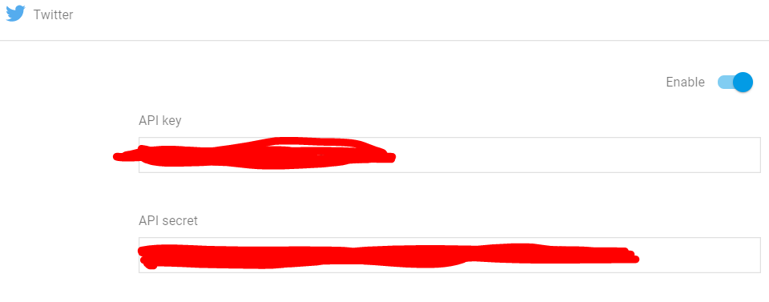
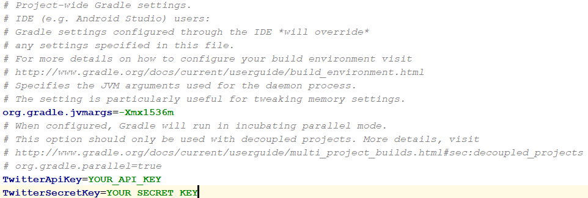

**Note: Systers has already a firebase account set up. The application uses that to provide
the functionality like Google Sign In, Twitter Sign In and Firebase database. If you are an
authorized developer, you might want to request access for the same instead of setting up a new account.**

To get started with Firebase, follow these steps:

1. Add firebase to your cloned project by following instructions mentioned in this
   [document](https://firebase.google.com/docs/android/setup).

2. Enable Google Sign-In for your firebase project by following instructions mentioned
   in this [document](https://firebase.google.com/docs/auth/android/google-signin).

3. Enable Twitter Sign-In for your firebase project by following instructions mentioned
   in this [document](https://firebase.google.com/docs/auth/android/twitter-login).

4. Copy the API Key and API secret for Twitter Login from your firebase console.    
   
   
5. Edit your project level `gradle.properties` file and add two variables `TwitterApiKey` and
   `TwitterSecretKey` as follows:    
   
   

6. Add data to your firebase database according to the following [schema](Schema.md).
   
